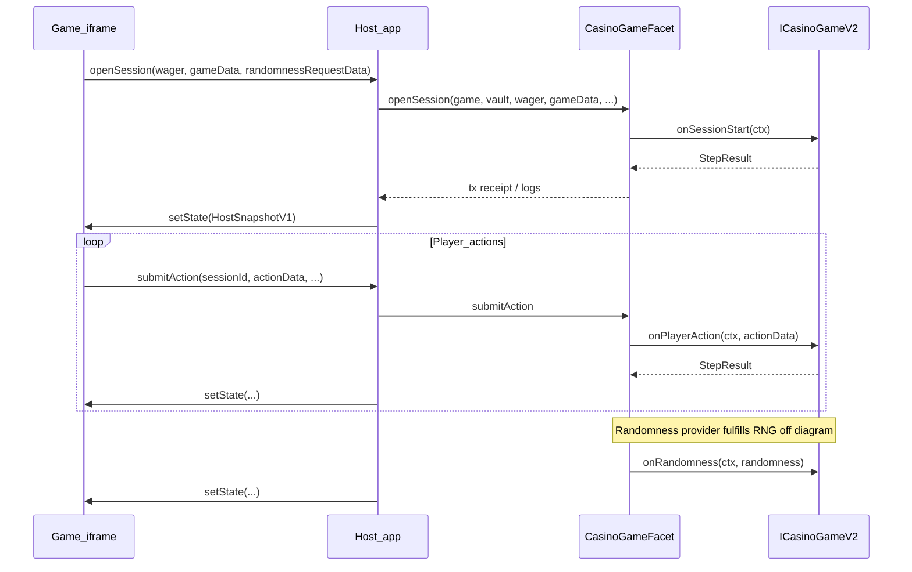

# Chain.wtf — building casino games guide

Chain.wtf is a fully decentralized wagering platform that consists of Sportsbook, Casino, fully on chain PvP games and predcition markets. It's built on top of Coinbase's Base L2 network and a unified liquidity pool that is used to back the winnings of the players.

This document is **self-contained**: you can follow it from a separate repository (e.g. Vite frontend + Forge/Hardhat) without any access to internal Chain.wtf source trees. Inline code blocks are the **canonical** types and patterns you need.

***

## 1. Platform model

**Host** (Chain.wtf web application) owns the user’s wallet, Smart Vault, session keys, and all transaction signing. It loads your game in an **iframe** and talks to it over a **promise-based bridge** (Penpal over `postMessage`). The iframe is typically sandboxed with `allow-scripts allow-same-origin` so the child origin is stable and the bridge can connect.

**Guest** (your game UI): **does not** connect a wallet or send raw transactions. It only:

* Encodes user intent as ABI-encoded **`gameData`** (at session open) and **`actionData`** (per player step).
* Calls **`hostApi.openSession`**, **`hostApi.submitAction`**, and optionally **`hostApi.cancelStuckRandomness`** — each returns a **Promise** (host signs/broadcasts txs).
* Calls **`hostApi.revealOutcome`** once its result presentation has finished, so the host credits withheld winnings to its balance displays (see §3.4).
* Renders from **`HostSnapshotV1`**, pushed by the host via **`guestApi.setState(snapshot)`** whenever wallet, balances, sessions, or UI settings change.

**Chain**: the protocol exposes **`CasinoGameFacet`** on the diamond/proxy. Your deployed game contract implements **`ICasinoGameV2`**. The facet orchestrates escrow, vault liquidity caps, randomness requests, and calls into your game’s pure/view step handlers.

***

## 2. On-chain architecture

### 2.1 `ICasinoGameV2` (full Solidity)

Your game contract must implement this interface. Phases, context, and step results are fixed by the platform.

```solidity
// SPDX-License-Identifier: MIT
pragma solidity ^0.8.30;

enum SessionPhase {
  NONE,
  WAITING_RANDOMNESS,
  WAITING_PLAYER_ACTION,
  SETTLED,
  FORFEITED,
  CANCELLED
}

struct SessionContext {
  uint256 sessionId;
  address player;
  address vault;
  uint256 wagerBase;
  uint256 escrowedStake;
  uint256 reservedProfit;
  uint32 step;
  bytes gameData;
  bytes gameState;
}

struct StepResult {
  bytes newGameState;
  int256 escrowDelta;
  int256 reservedProfitDelta;
  SessionPhase nextPhase;
  bool requestRandomnessNow;
  uint256 payout;
}

interface ICasinoGameV2 {
  function quoteCaps(
    uint256 wager,
    bytes calldata gameData
  ) external view returns (uint256 maxEscrowStake, uint256 maxReservedProfit);

  function quoteRiskParams(
    uint256 wager,
    bytes calldata gameData
  )
    external
    view
    returns (
      uint256 maxPayout,
      uint256 probabilityWad,
      uint256 expectedPayout,
      uint256 subJackpotVarianceScaled
    );

  function onSessionStart(
    SessionContext calldata ctx
  ) external view returns (StepResult memory);

  function onPlayerAction(
    SessionContext calldata ctx,
    bytes calldata actionData
  ) external view returns (StepResult memory);

  function onRandomness(
    SessionContext calldata ctx,
    bytes32 randomness
  ) external view returns (StepResult memory);

  function quoteForfeitPayout(SessionContext calldata ctx) external view returns (uint256 cashoutValue);
}
```

**Semantics:**

* **`quoteCaps`**: Before `openSession`, the facet requires `maxEscrowStake >= wager` and enforces the per-session cap using `maxReservedProfit` vs `maxBetRiskBps`.
* **`quoteRiskParams`**: Supplies the portfolio-risk inputs for the vault reserve model. `probabilityWad` uses WAD precision (`1e18 = 100%`). `maxPayout` is the worst-case total player payout, `expectedPayout` is the RTP-based mean payout, and `subJackpotVarianceScaled` is normally `0` unless a heavy-tail game precomputes a Tier-2 variance term.
* **`onSessionStart`**: Called immediately after the session is created with the player’s wager pulled in; you return the next phase and updated opaque **`newGameState`**.
* **`onPlayerAction`**: Only when the facet is in **`WAITING_PLAYER_ACTION`** and the player calls **`submitAction`** in time (before `actionDeadlineBlock`).
* **`onRandomness`**: Called when the randomness provider fulfills a request; your game consumes **`bytes32`** RNG and returns the next step or terminal settlement.
* **`quoteForfeitPayout`**: The current cash-out value (stake + accrued winnings) derived from `ctx.gameState`; return `0` when nothing is cashable mid-round. When an abandoned session is forfeited after `actionDeadlineBlock`, the facet pays the player this quote (clamped to `escrowedStake + reservedProfit`) **minus a 10% cut** instead of confiscating the whole stake. The call is defensive: if it reverts or returns malformed data — or the game predates the method — the forfeit pays `0`. Implement it faithfully **only** in games with a true anytime cash-out whose value is fully determined by already-revealed state (mines-style). Games whose mid-round value depends on unresolved randomness or hidden state (blackjack-style) **must return `0`**: any concrete quote there is an adverse-selection exploit — the player abandons exactly when the real continuation value is below the quote (a bad blackjack hand can be worth ~0.3× stake while a stake-based quote pays out 0.9×), turning forfeiture into a free put option against the vault.

#### Consuming randomness: unbiased d6

Games that map facet **`bytes32`** randomness to six-sided dice **must** use **rejection sampling** — accept only bytes `< 252`, then `(byte % 6) + 1`. **Do not** use raw `randomness[i] % 6` on a byte (modulo bias: faces 1–4 are slightly more likely than 5–6).

Full algorithm, Solidity/TypeScript reference implementations, and an agent DO/DON'T checklist: **[`RANDOMNESS_DICE.md`](./RANDOMNESS_DICE.md)**.

**Escrow / profit:**

* **`escrowDelta`**: positive = extra tokens pulled from the player into facet escrow (e.g. double down); negative = release to player.
* **`reservedProfitDelta`**: commits or releases vault “reserved profit” according to risk math (combined with protocol libraries).

### 2.1.1 Risk quoting contract requirements

The protocol now separates **session caps** from **portfolio reserve math**:

* `quoteCaps` answers: "What is the largest escrow / reserved-profit this single session may need?"
* `quoteRiskParams` answers: "How much marginal reserve should this session contribute to the vault-wide casino portfolio?"

The facet uses both during `openSession`:

1. Enforce the per-bet whale cap with `maxReservedProfit`.
2. Add the session's `(maxPayout, probabilityWad, subJackpotVarianceScaled)` into the vault aggregate.
3. Recompute the required casino reserve using the portfolio VaR model.
4. Revert if the updated reserve exceeds available liquidity.

For the current built-in games:

* **Coinflip** returns the exact combinatorial win probability in WAD.
* **Mines** returns the probability of the full-board cashout path `1 / C(25, mineCount)` in WAD.
* **Blackjack** returns a conservative fixed `5e16` WAD (`5%`) for the 4x worst-case path.
* **Heavy-tail slots / jackpots** should additionally return `subJackpotVarianceScaled` so the facet can switch from single-tier normal VaR to the tiered jackpot reserve path.

### 2.2 `CasinoGameFacet` responsibilities (summary)

The facet (names only — your deployment uses the protocol’s verified ABI):

| Entry                                                              | Role                                                                                                                                                                                                                                                                         |
| ------------------------------------------------------------------ | ---------------------------------------------------------------------------------------------------------------------------------------------------------------------------------------------------------------------------------------------------------------------------- |
| `openSession(game, vault, wager, gameData, randomnessRequestData)` | Validates whitelist, vault, min bet, caps from `quoteCaps`, risk inputs from `quoteRiskParams`, updates the casino portfolio reserve, transfers wager in, creates session, runs `onSessionStart`, then applies `StepResult` (may request RNG, wait for player, or finalize). |
| `submitAction(sessionId, actionData, randomnessRequestData)`       | Requires phase `WAITING_PLAYER_ACTION`, player `msg.sender`, not past action deadline; runs `onPlayerAction`.                                                                                                                                                                |
| `onRandomnessFulfilled(requestId, randomness)`                     | Provider callback; runs `onRandomness` on the game.                                                                                                                                                                                                                          |
| `getSession(sessionId)`                                            | View full session struct (includes `gameData`, `gameState`, phase, deadlines, etc.).                                                                                                                                                                                         |
| `forfeitExpiredSession` / `forfeitExpiredSessions`                 | If phase `WAITING_PLAYER_ACTION` and block > action deadline → forfeit.                                                                                                                                                                                                   |
| `cancelStuckRandomness`                                            | If phase `WAITING_RANDOMNESS` and randomness deadline passed → cancel and refund per facet rules.                                                                                                                                                                            |

Randomness is requested **by the facet** using `randomnessRequestData` you pass from the UI (often **`0x`**). The game iframe **never** receives the RNG directly from a wallet; settlement is on-chain.

### 2.3 Contract patterns: instant vs multi-action

**Instant game (e.g. coinflip)** — session resolves without `submitAction`:

* `onSessionStart` → **`nextPhase = WAITING_RANDOMNESS`**, **`requestRandomnessNow = true`**.
* `onPlayerAction` **reverts** (no player steps).
* `onRandomness` → **`SETTLED`** with payout (encode the result in `newGameState`).

Illustrative excerpt:

```solidity
function onSessionStart(
  SessionContext calldata ctx
) external pure returns (StepResult memory stepResult) {
  // ... decode ctx.gameData, compute maxReservedProfit ...
  stepResult.newGameState = abi.encode(/* opaque state */);
  stepResult.escrowDelta = 0;
  stepResult.reservedProfitDelta = int256(maxReservedProfit);
  stepResult.nextPhase = SessionPhase.WAITING_RANDOMNESS;
  stepResult.requestRandomnessNow = true;
  stepResult.payout = 0;
}

function onPlayerAction(
  SessionContext calldata,
  bytes calldata
) external pure returns (StepResult memory) {
  revert CoinflipGame__NoPlayerAction();
}

function onRandomness(
  SessionContext calldata ctx,
  bytes32 randomness
) external pure returns (StepResult memory stepResult) {
  // ... compute payout, set stepResult.nextPhase = SessionPhase.SETTLED, etc.
}
```

**Multi-action game (e.g. mines)** — opens on player’s turn:

* `onSessionStart` → **`WAITING_PLAYER_ACTION`**, **`requestRandomnessNow = false`**.
* `onPlayerAction` decodes `actionData` (reveal tile, cash out, etc.); may transition to **`WAITING_RANDOMNESS`** with **`requestRandomnessNow = true`** for a single tile reveal, then `onRandomness` continues the state machine or settles.

Illustrative excerpt:

```solidity
function onSessionStart(
  SessionContext calldata ctx
) external pure returns (StepResult memory stepResult) {
  uint8 mineCount = _decodeAndValidateGameData(ctx.gameData);
  uint256 maxPayout = _cashoutPayout(ctx.wagerBase, mineCount, TILE_COUNT - mineCount);
  uint256 maxReservedProfit = maxPayout > ctx.wagerBase ? maxPayout - ctx.wagerBase : 0;

  stepResult.newGameState = abi.encode(/* initial MinesState */);
  stepResult.escrowDelta = 0;
  stepResult.reservedProfitDelta = int256(maxReservedProfit);
  stepResult.nextPhase = SessionPhase.WAITING_PLAYER_ACTION;
  stepResult.requestRandomnessNow = false;
  stepResult.payout = 0;
}
```

### 2.4 Sequence: open session → chain → snapshot back to iframe



***

## 3. Bridge SDK (guest + host)

The npm package name used in production is **`@chain/casino-sdk`**. If it is not published publicly, **vendor** the three modules below into your repo (same exports: `./guest`, `./host`, `.`).

**Dependency:** `penpal` **^7.0.4** (child connects to `window.parent`; host connects to `iframe.contentWindow`).

### 3.1 `types.ts`

```typescript
export type HexString = `0x${string}`;

export type CasinoGameManifestV1 = {
  schemaVersion: 1;
  gameId: string;
  apiVersion: 1;
  defaultLocale: string;
  locales: Record<
    string,
    {
      name: string;
      description?: string;
    }
  >;
  assets?: {
    iconUrl?: string;
    coverUrl?: string;
  };
};

export type HostSnapshotV1 = {
  apiVersion: number;
  integration: {
    chainId: number;
    slug: string;
    gameAddress: `0x${string}`;
    manifest: CasinoGameManifestV1;
  };
  wallet: {
    address?: `0x${string}`;
    smartVaultAddress?: `0x${string}`;
    status: 'ready' | 'disconnected' | 'setup-required' | 'session-key-mismatch';
  };
  token: {
    symbol?: string;
    decimals?: number;
  };
  balances: {
    smartVaultBalance?: string;
  };
  casino?: {
    availableLiquidity?: string;
    maxBetRiskBps?: number;
    maxAllowedReservedProfit?: string;
    maxBetAmount?: string;
  };
  sessions: {
    items: Array<{
      sessionId: string;
      sessionKey: string;
      gameAddress: `0x${string}`;
      phase?: number;
      phaseName?: string;
      wager?: string;
      // Total escrowed stake — wager plus mid-session increases (e.g. a
      // blackjack double). Absent on older hosts and on sessions from before
      // CasinoSessionEscrowUpdated existed; fall back to `wager`.
      stake?: string;
      payout?: string;
      isSettled: boolean;
      openedAt?: number;
      settledAt?: number;
      lastEventTimestamp: number;
      raw: {
        gameData?: HexString;
        gameState?: HexString;
        randomness?: HexString;
        requestId?: HexString;
      };
    }>;
  };
  ui: {
    locale: string;
    theme: 'light' | 'dark' | 'system';
    viewport?: {
      // Height in px from the top of the game's iframe to the bottom edge of
      // the visible screen, before the user scrolls. To place your primary
      // action (e.g. the bet button) exactly at the screen edge, size the
      // content above it to `availableHeight` minus the action's own height.
      // Do not use CSS viewport units for this: the host grows the iframe to
      // fit your content, so inside the iframe 100vh equals the full content
      // height, not the visible screen.
      availableHeight: number;
    };
  };
};

export type HostApiV1 = {
  reportContentSize?(input: { minHeight: number }): Promise<void>;
  openSession(input: {
    wager: string;
    gameData: HexString;
    randomnessRequestData?: HexString;
  }): Promise<{ sessionKey: string; transactionHash: HexString }>;
  submitAction(input: {
    sessionId: string;
    actionData: HexString;
    randomnessRequestData?: HexString;
    approvalAmount?: string;
  }): Promise<{ transactionHash: HexString }>;
  cancelStuckRandomness(input: { sessionId: string }): Promise<{ transactionHash: HexString }>;
  revealOutcome(input: { sessionId: string }): Promise<void>;
};

export type GuestApiV1 = {
  setState(snapshot: HostSnapshotV1 | null): Promise<void>;
};

export type CasinoGameManifestValidationResult =
  | {
      ok: true;
      manifest: CasinoGameManifestV1;
    }
  | {
      ok: false;
      reason: string;
    };

export type GameManifestLocale = {
  locale: string;
  name: string;
  description?: string;
};

export type GameManifestMetadata = {
  locale: string;
  name: string;
  description?: string;
  iconUrl?: string;
  coverUrl?: string;
};
```

### 3.2 `guest.ts` (iframe / game side)

```typescript
import { WindowMessenger, connect } from 'penpal';
import type { Connection } from 'penpal';
import type { GuestApiV1, HostApiV1 } from './types';

export type { GuestApiV1, HostApiV1, HostSnapshotV1 } from './types';

export type GuestBridgeConnection = Connection<HostApiV1>;

const getAllowedParentOrigins = (): string[] => {
  if (typeof document === 'undefined' || !document.referrer) {
    return ['*'];
  }

  try {
    return [new URL(document.referrer).origin];
  } catch {
    return ['*'];
  }
};

export const connectGameToHost = (methods: GuestApiV1): GuestBridgeConnection =>
  connect<HostApiV1>({
    messenger: new WindowMessenger({
      remoteWindow: window.parent,
      allowedOrigins: getAllowedParentOrigins(),
    }),
    methods,
  });
```

### 3.3 `host.ts` (parent page)

```typescript
import { WindowMessenger, connect } from 'penpal';
import type { Connection } from 'penpal';
import type { GuestApiV1, HostApiV1 } from './types';

export type { GuestApiV1, HostApiV1, HostSnapshotV1 } from './types';

export type HostBridgeConnection = Connection<GuestApiV1>;

export const connectHostToGame = (options: {
  iframe: HTMLIFrameElement;
  childOrigin: string;
  methods: HostApiV1;
}): HostBridgeConnection => {
  const remoteWindow = options.iframe.contentWindow;
  if (!remoteWindow) {
    throw new Error('Iframe contentWindow is not available.');
  }

  return connect<GuestApiV1>({
    messenger: new WindowMessenger({
      remoteWindow,
      allowedOrigins: [options.childOrigin],
    }),
    methods: options.methods,
  });
};
```

### 3.4 Guest lifecycle (required pattern)

1. On mount, call **`connectGameToHost`** with **`GuestApiV1`** where **`setState`** stores the latest snapshot in React state (or your framework).
2. **`await connection.promise`** (or `.then`) to receive **`HostApiV1`** — enable buttons that call **`openSession` / `submitAction`** only after this resolves.
3. When your result presentation finishes (reels stopped, bonus round played out), you **must** call **`hostApi.revealOutcome({ sessionId })`** so the host credits the payout to its balance UI. Sessions settle on-chain well before your animation ends; from bet placement until your reveal, the host **clamps its balance displays so they can move down but never up** — debits show, winnings stay hidden — so the top-bar balance never spoils the outcome. It is the reverse of an optimistic update: the payout is final, only its display is delayed until you reveal it. The guard only exists while your game is mounted: refreshing the page or navigating away shows the real balance immediately. Losses need no reveal (the wager left at open, so settlement moves no balance and the host releases the guard itself), but calling it after a loss is a harmless no-op.
4. On unmount, call **`connection.destroy()`**.

### 3.5 Host lifecycle (minimal pattern)

The host must:

1. Create an iframe with `src` pointing at your deployed game URL (HTTPS origin = **`childOrigin`**).
2. Call **`connectHostToGame({ iframe, childOrigin, methods })`** where **`methods`** implements **`HostApiV1`** (real tx signing).
3. When **`connection.promise`** resolves, call **`guestApi.setState(snapshot)`** once with the current snapshot.
4. On every snapshot update (wallet, sessions, balances), call **`guestApi.setState`** again.

Use **stable** function references for `openSession` / `submitAction` / `cancelStuckRandomness` / `revealOutcome` that **delegate** to the latest closure (so reconnects do not stale). Minimal illustration:

```typescript
const latestMethodsRef = useRef(hostMethods);
latestMethodsRef.current = hostMethods;

const stableMethods: HostApiV1 = {
  openSession: input => latestMethodsRef.current.openSession(input),
  submitAction: input => latestMethodsRef.current.submitAction(input),
  cancelStuckRandomness: input => latestMethodsRef.current.cancelStuckRandomness(input),
};

const connection = connectHostToGame({
  iframe,
  childOrigin: new URL(gameUrl).origin,
  methods: stableMethods,
});

void connection.promise.then(async guestApi => {
  await guestApi.setState(currentSnapshot);
});
```

**Teardown:** destroy the Penpal connection when the iframe is removed. Avoid **`setState(null)`** racing iframe teardown (can throw if the connection is already destroyed).

***

## 4. Using `HostSnapshotV1` in the game UI

| Field                             | Use                                                                                                                               |
| --------------------------------- | --------------------------------------------------------------------------------------------------------------------------------- |
| `wallet.status`                   | Only enable betting when **`'ready'`**; show setup prompts for **`setup-required`** / **`session-key-mismatch`**.                 |
| `token.decimals`                  | Parse human wager input with **`viem`** **`parseUnits`**.                                                                         |
| `token.iconUrl`                   | Optional absolute URL of the token icon for balance / wager displays.                                                             |
| `balances.smartVaultBalance`      | Display spendable balance (host-defined).                                                                                         |
| `casino.maxAllowedReservedProfit` | Client-side **preview** for max house exposure vs wager (e.g. mines); **on-chain** still enforces.                                |
| `casino.maxBetAmount`             | Absolute per-game wager ceiling when the platform sets one; unset or `'0'` = none.                                                |
| `sessions.items`                  | Each row: **`sessionId`**, **`sessionKey`**, **`phaseName`**, **`wager`**, **`payout`**, **`raw.gameData`**, **`raw.gameState`**. |

**`sessionKey` format** (host convention): **`${chainId}:${sessionIdDecimal}`** — use it to match a session after `openSession` returns until the indexer + on-chain view catch up.

**Terminal phases:** `SETTLED`, `FORFEITED`, `CANCELLED` — treat as ended for UX.

### Snapshot update semantics (read this before animating anything)

`guestApi.setState` fires on **every** host-side state change — balances, casino
risk limits, locale, viewport, session rows — not only on your session's
transitions. The host deduplicates byte-identical snapshots, but distinct
snapshots where nothing about *your* session changed are normal. Treat
`setState` as "here is the current state", never as "something happened":

* **Derive, don't accumulate.** Render each session from its current
  `raw.gameState` (plus `phaseName` / `payout`). Compare against what you last
  rendered for that `sessionId` and animate only the difference. Never replay
  a session's presentation from scratch because a new snapshot arrived.
* **A session is new only when its `sessionId` is new.** Phase changes within
  a known session are progress, never a fresh round.
* **Mid-round `WAITING_RANDOMNESS` is normal for multi-action games.** Every
  action that consumes randomness (blackjack hit/double/split/stand, a mines
  reveal) moves the session `WAITING_PLAYER_ACTION → WAITING_RANDOMNESS →
  WAITING_PLAYER_ACTION | SETTLED`. Only the session's *first*
  `WAITING_RANDOMNESS` (before any `gameState` you have rendered) is the
  opening deal. Do **not** reset the table when a round you are already
  rendering enters `WAITING_RANDOMNESS` — show a waiting affordance (dealer
  thinking, tile flipping) and keep the rendered state. The `gameState` bytes
  accompanying that transition already include the accepted action.
* **`isSettled` flips once, atomically** with `payout` and the final
  `gameState`; present the outcome from that final state, then call
  `revealOutcome`.

> Compatibility note: the production host currently suppresses mid-round
> `WAITING_RANDOMNESS` states (a round appears to sit in
> `WAITING_PLAYER_ACTION` until it settles). This is legacy behavior slated
> for removal; the local simulator already delivers the full stream. Build and
> test against the simulator — a game correct there is correct on both.

### Clamping the bet size (`casino` block)

`openSession` rejects any bet whose worst-case win (**reserved profit** = max payout minus
wager) exceeds **`casino.maxAllowedReservedProfit`** — a live number the host refreshes from the
house vault (`availableLiquidity × maxBetRiskBps / 10000`). A high top multiplier shrinks the
acceptable wager dramatically: at 1% risk cap and a 5000x jackpot, a 50M-token pool only accepts
\~100-token bets. Clamp your bet input so players never submit a wager the chain will bounce:

```ts
import { computeMaxWager } from '@chain/casino-sdk/guest';

// Worst-case payout is `wager * maxMultiplierX` (the usual linear quoteCaps).
const maxWager = computeMaxWager(snapshot, { maxMultiplierX: 5000 });
// → cap the bet input / "Max" button at min(maxWager, balance); undefined = host
//   didn't publish limits (older host), fall back to your own limits.
```

`computeMaxWager` mirrors the facet's check and accounts for `maxBetAmount` automatically. If
your reserved profit is **not** linear in the wager (multiplier depends on `gameData`, e.g.
mines or plinko), recompute per selection — pass the multiplier for the *current* pick — or
invert your own `quoteCaps` math against `maxAllowedReservedProfit` exactly, like the bundled
coinflip example does for its combinatorial paytable. Recheck on every snapshot: the limit moves
with pool liquidity.

***

## 5. `game.manifest.json` — host validation

The TypeScript type **`CasinoGameManifestV1`** is minimal; the **host validator** requires extra fields: **`presentation`** and **`capabilities`**. Use the validator below when building your static manifest.

### 5.1 `canonicalCasinoGameId` and `validateCasinoGameManifest`

```typescript
import type {
  CasinoGameManifestV1,
  CasinoGameManifestValidationResult,
  GameManifestMetadata,
} from './types';

const isRecord = (value: unknown): value is Record<string, unknown> =>
  typeof value === 'object' && value !== null;

const hasString = (value: unknown): value is string =>
  typeof value === 'string' && value.length > 0;

/** Matches on-chain normalizeGameName / manifest gameId conventions (strip trailing "Game", lowercase, alnum only). */
export const canonicalCasinoGameId = (value: string | undefined | null): string => {
  if (!value) {
    return '';
  }

  let trimmed = value.trim();
  if (trimmed.match(/Game$/i)) {
    trimmed = trimmed.replace(/Game$/i, '');
  }

  return trimmed.toLowerCase().replace(/[^a-z0-9]/g, '');
};

const hasOptionalString = (value: unknown): value is string | undefined =>
  value === undefined || typeof value === 'string';

/** Minimal validation for routing + catalog; full shape still typed as CasinoGameManifestV1. */
export const validateCasinoGameManifest = (value: unknown): CasinoGameManifestValidationResult => {
  if (!isRecord(value)) {
    return { ok: false, reason: 'Manifest must be an object.' };
  }

  const { schemaVersion, apiVersion, gameId, defaultLocale, locales, presentation, capabilities } =
    value;

  if (schemaVersion !== 1 || apiVersion !== 1) {
    return { ok: false, reason: 'Unsupported manifest schemaVersion or apiVersion.' };
  }

  if (!hasString(gameId) || !hasString(defaultLocale)) {
    return { ok: false, reason: 'Manifest gameId and defaultLocale are required.' };
  }

  if (!isRecord(locales) || Object.keys(locales).length === 0) {
    return { ok: false, reason: 'Manifest locales must contain at least one locale.' };
  }

  const defaultLocaleEntry = locales[defaultLocale];
  if (!isRecord(defaultLocaleEntry) || !hasString(defaultLocaleEntry.name)) {
    return { ok: false, reason: 'Manifest defaultLocale must exist in locales.' };
  }

  if (
    !isRecord(presentation) ||
    (presentation.mode !== 'full-iframe' && presentation.mode !== 'embedded') ||
    !isRecord(presentation.hostPanels) ||
    typeof presentation.hostPanels.openSession !== 'boolean' ||
    typeof presentation.hostPanels.history !== 'boolean' ||
    typeof presentation.hostPanels.status !== 'boolean'
  ) {
    return { ok: false, reason: 'Manifest presentation is invalid.' };
  }

  if (
    !isRecord(capabilities) ||
    capabilities.openSession !== true ||
    typeof capabilities.submitAction !== 'boolean' ||
    typeof capabilities.forfeitExpiredSession !== 'boolean' ||
    typeof capabilities.cancelStuckRandomness !== 'boolean' ||
    typeof capabilities.resize !== 'boolean'
  ) {
    return { ok: false, reason: 'Manifest capabilities are invalid.' };
  }

  const assets = value.assets;
  if (assets !== undefined) {
    if (
      !isRecord(assets) ||
      !hasOptionalString(assets.iconUrl) ||
      !hasOptionalString(assets.coverUrl)
    ) {
      return { ok: false, reason: 'Manifest assets are invalid.' };
    }
  }

  return {
    ok: true,
    manifest: value as CasinoGameManifestV1,
  };
};

export const resolveManifestMetadata = (
  manifest: CasinoGameManifestV1,
  requestedLocale: string,
): GameManifestMetadata => {
  const locale =
    manifest.locales[requestedLocale] !== undefined ? requestedLocale : manifest.defaultLocale;
  const localized = manifest.locales[locale] ?? manifest.locales[manifest.defaultLocale];

  return {
    locale,
    name: localized.name,
    description: localized.description,
    iconUrl: manifest.assets?.iconUrl,
    coverUrl: manifest.assets?.coverUrl,
  };
};

export const assertSameOriginUrls = (manifestUrl: string, iframeUrl: string): boolean => {
  try {
    const manifestOrigin = new URL(manifestUrl).origin;
    const iframeOrigin = new URL(iframeUrl).origin;

    return manifestOrigin === iframeOrigin;
  } catch {
    return false;
  }
};
```

### 5.2 Example manifests

**Blackjack** — multi-action, forfeit + cancel RNG:

```json
{
  "schemaVersion": 1,
  "gameId": "BlackjackGame",
  "apiVersion": 1,
  "defaultLocale": "en",
  "locales": {
    "en": {
      "name": "Blackjack",
      "description": "Render and control the active blackjack table using host-provided on-chain session state."
    }
  },
  "presentation": {
    "mode": "full-iframe",
    "hostPanels": {
      "openSession": false,
      "history": false,
      "status": false
    }
  },
  "capabilities": {
    "openSession": true,
    "submitAction": true,
    "forfeitExpiredSession": true,
    "cancelStuckRandomness": true,
    "resize": true
  }
}
```

**Mines** — multi-action, cancel stuck randomness:

```json
{
  "schemaVersion": 1,
  "gameId": "MinesGame",
  "apiVersion": 1,
  "defaultLocale": "en",
  "locales": {
    "en": {
      "name": "Mines",
      "description": "Reveal safe tiles on a 5x5 grid and cash out before the next reveal hits a mine."
    }
  },
  "presentation": {
    "mode": "full-iframe",
    "hostPanels": {
      "openSession": false,
      "history": false,
      "status": false
    }
  },
  "capabilities": {
    "openSession": true,
    "submitAction": true,
    "forfeitExpiredSession": false,
    "cancelStuckRandomness": true,
    "resize": true
  }
}
```

**Coinflip** — instant round (no `submitAction` in the iframe):

```json
{
  "schemaVersion": 1,
  "gameId": "CoinflipGame",
  "apiVersion": 1,
  "defaultLocale": "en",
  "locales": {
    "en": {
      "name": "Coinflip",
      "description": "Flip one or more coins and settle the round from host-provided on-chain state."
    }
  },
  "presentation": {
    "mode": "full-iframe",
    "hostPanels": {
      "openSession": false,
      "history": false,
      "status": false
    }
  },
  "capabilities": {
    "openSession": true,
    "submitAction": false,
    "forfeitExpiredSession": false,
    "cancelStuckRandomness": false,
    "resize": true
  }
}
```

***

## 6. Frontend patterns (reference implementations)

Use **`viem`** for **`encodeAbiParameters` / `decodeAbiParameters` / `formatUnits` / `parseUnits`**. Constant **`EMPTY_HEX = '0x'`** is valid **`randomnessRequestData`** when your game does not need extra provider payload.

### 6.1 Shared bridge bootstrap (all games)

```tsx
import { useEffect, useState } from 'react';
import {
  connectGameToHost,
  type GuestApiV1,
  type HostApiV1,
  type HostSnapshotV1,
} from '@chain/casino-sdk/guest';

export function App() {
  const [hostApi, setHostApi] = useState<HostApiV1 | null>(null);
  const [snapshot, setSnapshot] = useState<HostSnapshotV1 | null>(null);

  useEffect(() => {
    let mounted = true;

    const guestMethods: GuestApiV1 = {
      async setState(nextSnapshot) {
        if (!mounted) {
          return;
        }
        setSnapshot(nextSnapshot);
      },
    };

    const connection = connectGameToHost(guestMethods);

    void connection.promise
      .then(parent => {
        if (mounted) {
          setHostApi(parent);
        }
      })
      .catch(() => {
        /* handle */
      });

    return () => {
      mounted = false;
      connection.destroy();
    };
  }, []);

  if (!hostApi || !snapshot) {
    return <section>Connecting to host…</section>;
  }

  return null;
}
```

### 6.2 Coinflip (instant — `openSession` only)

Encode **`gameData`** to match your **`CoinflipGame`** ABI, e.g. `(bool pickHeads, uint8 coinCount, uint8 minWins)`:

```tsx
const EMPTY_HEX = '0x' as const;

async function handleOpenSession(
  hostApi: HostApiV1,
  snapshot: HostSnapshotV1,
  wagerInput: string,
  side: 'heads' | 'tails',
  coinCount: number,
  minWins: number,
) {
  const decimals = snapshot.token.decimals ?? 18;
  const wager = parseUnits(wagerInput, decimals).toString();
  const gameData = encodeAbiParameters(
    [{ type: 'bool' }, { type: 'uint8' }, { type: 'uint8' }],
    [side === 'heads', coinCount, minWins],
  );

  const { sessionKey } = await hostApi.openSession({
    wager,
    gameData,
    randomnessRequestData: EMPTY_HEX,
  });
  // Track sessionKey until snapshot lists the session and outcome is known
}
```

Decode **`raw.gameData`** / **`raw.gameState`** for display; for coinflip, randomness often appears inside **`gameState`** after the contract encodes it (game-specific ABI).

### 6.3 Blackjack (multi-action + `approvalAmount`)

Open with rules packed in **`gameData`** (example: `uint8` blackjack payout mode + `bool` dealer hits soft 17):

```tsx
const EMPTY_HEX = '0x' as const;
const PAYOUT_THREE_TO_TWO = 0;
const DEFAULT_DEALER_HITS_SOFT_17 = false;

async function handleOpenSession(hostApi: HostApiV1, snapshot: HostSnapshotV1, wagerInput: string) {
  const wager = parseUnits(wagerInput, snapshot.token.decimals ?? 18).toString();
  const gameData = encodeAbiParameters(
    [{ type: 'uint8' }, { type: 'bool' }],
    [PAYOUT_THREE_TO_TWO, DEFAULT_DEALER_HITS_SOFT_17],
  );

  await hostApi.openSession({
    wager,
    gameData,
    randomnessRequestData: EMPTY_HEX,
  });
}

async function handleAction(
  hostApi: HostApiV1,
  activeSession: HostSnapshotV1['sessions']['items'][number],
  actionCode: number,
  requiresExtraStake: boolean,
) {
  await hostApi.submitAction({
    sessionId: activeSession.sessionId,
    actionData: encodeAbiParameters([{ type: 'uint8' }], [actionCode]),
    randomnessRequestData: EMPTY_HEX,
    approvalAmount: requiresExtraStake ? activeSession.wager : undefined,
  });
}
```

**`approvalAmount`**: when the player **doubles** or **splits**, the facet may need an additional **`escrowDelta`**; the host batches **ERC20 `approve(proxy, amount)`** + **`submitAction`**. Pass the **base wager string** as `approvalAmount` when your UI enables those actions.

### 6.4 Mines (multi-action + risk limit UX)

Open round with mine count:

```tsx
const EMPTY_HEX = '0x' as const;

async function handleOpenSession(
  hostApi: HostApiV1,
  snapshot: HostSnapshotV1,
  wagerInput: string,
  mineCount: number,
) {
  const wager = parseUnits(wagerInput, snapshot.token.decimals ?? 18).toString();
  const gameData = encodeAbiParameters([{ type: 'uint8' }], [mineCount]);

  await hostApi.openSession({
    wager,
    gameData,
    randomnessRequestData: EMPTY_HEX,
  });
}

const ACTION_REVEAL = 0;
const ACTION_CASHOUT = 1;

async function handleReveal(
  hostApi: HostApiV1,
  activeSession: HostSnapshotV1['sessions']['items'][number],
  tileIndex: number,
) {
  await hostApi.submitAction({
    sessionId: activeSession.sessionId,
    actionData: encodeAbiParameters(
      [{ type: 'uint8' }, { type: 'uint8' }],
      [ACTION_REVEAL, tileIndex],
    ),
    randomnessRequestData: EMPTY_HEX,
  });
}

async function handleCashout(
  hostApi: HostApiV1,
  activeSession: HostSnapshotV1['sessions']['items'][number],
) {
  await hostApi.submitAction({
    sessionId: activeSession.sessionId,
    actionData: encodeAbiParameters([{ type: 'uint8' }, { type: 'uint8' }], [ACTION_CASHOUT, 0]),
    randomnessRequestData: EMPTY_HEX,
  });
}
```

**Risk preview:** compare your computed **`maxReservedProfit`** for the chosen wager + mines to **`snapshot.casino.maxAllowedReservedProfit`** (bigint compare) to disable **Open** before the user hits chain. The **`CasinoGameFacet__BetRiskExceedsLimit`** selector may appear in revert data — map it to a friendly message.

**Stuck randomness:** optional **`cancelStuckRandomness({ sessionId })`** when `phaseName === 'WAITING_RANDOMNESS'` and the host exposes recovery (mines manifest sets **`cancelStuckRandomness: true`**).

***

## 7. Host integrator checklist (signing + snapshot)

If you implement the parent app (not the iframe), you must:

1. **Approve + openSession:** Encode **`CasinoGameFacet.openSession(gameAddress, vault, wager, gameData, randomnessRequestData)`**. Prepend **ERC20 `approve(facetOrProxy, wager)`** from the player’s funding path (EOA or Smart Vault batch).
2. **Parse `sessionId`:** From **`CasinoSessionOpened`** logs after the transaction, build **`sessionKey = \`${chainId}:${sessionId}\`**\`.
3. **submitAction:** Optionally prepend **`approve`** when the guest passes **`approvalAmount`**; then **`submitAction(sessionId, actionData, randomnessRequestData)`**.
4. **Snapshot freshness:** Merge **indexer/session list** with **`getSession(sessionId)`** reads so **`raw.gameData`** and **`raw.gameState`** match on-chain bytes for decoding in the iframe.
5. **Push updates:** Call **`guestApi.setState`** whenever wallet, token balances, session rows, casino risk fields, locale, theme, or viewport change.

***

## 8. Appendix

### 8.1 Guest `package.json` dependencies (example)

```json
{
  "dependencies": {
    "@chain/casino-sdk": "^0.1.0",
    "penpal": "^7.0.4",
    "react": "^19.0.0",
    "viem": "^2.x"
  }
}
```

Use the version your registry publishes, or remove this dependency entirely if you vendor the SDK sources.

If **`@chain/casino-sdk`** is **not** on a public registry, **copy** the **`types.ts`**, **`guest.ts`**, and **`host.ts`** sources into your repo (preserve exports **`./guest`** and **`./host`**) and depend on **`penpal`** directly.

### 8.2 Security notes

* Penpal **origin allowlisting**: the host passes **`childOrigin`**; the guest allows the **referrer** origin when **`document.referrer`** is parseable, else **`*`** (development only — production games should be served from a stable origin behind HTTPS).
* **Never** trust client-only math for payouts — **always** treat **`gameState`** and balances as **hints**; the **facet + game contract** are authoritative.

***

*End of document.*
